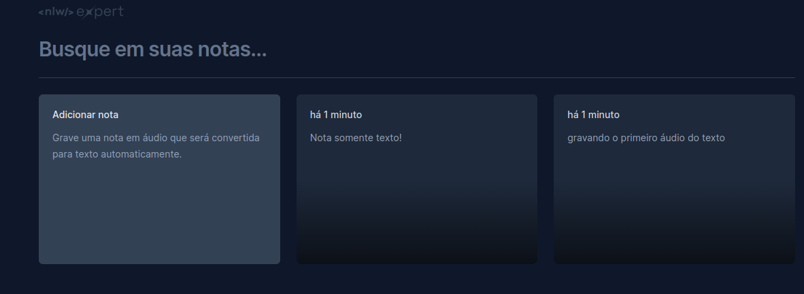

<h1 align="center">
    
</h1>

## 💻 Sobre a aplicação
Uma aplicação de Notas para gravar uma nota usando áudio sendo convertido em texto e também texto comum.
Aplicação criada durante o evento NLW Experts da Rocketseat.

## 🛠 Tecnologias

As seguintes ferramentas foram usadas na construção do projeto:

- React
- TypeScript
- Tailwind
- Radix UI
- SpeechRecognition API

